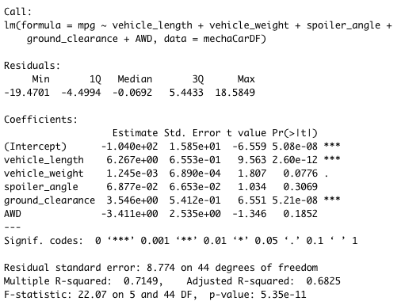
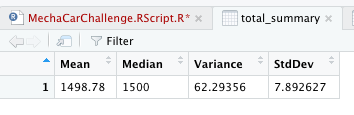
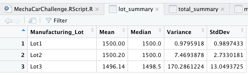
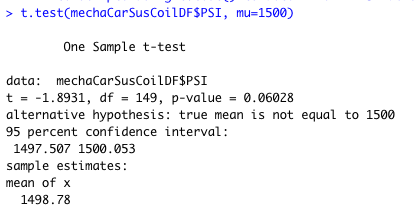
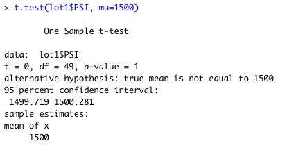
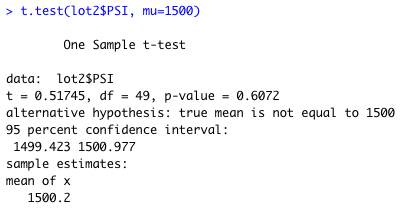
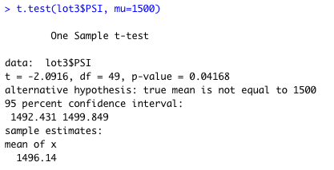

# MechaCar_Statistical_Analysis

## Linear Regression to Predict MPG
Using the following output, we can assess our linear model:

  

**1. Which variables/coefficients provided a non-random amount of variance to the mpg values in the dataset?**

   Vehicle Length (p-value: 2.60e-12) and Ground Clearance (p-value: 5.21e-08) provide non-random amounts of variance to the mpg values due to their p-values being below 0.05. This means they are statistically significant to the mpg measure on these vehicles. 

**2. Is the slope of the linear model considered to be zero? Why or why not?**

   The slope of this linear model is not zero. This is evidenced by the fact that our p-value (5.25e-11) is MUCH smaller than our assumed signficance level of 0.05%.

**3. Does this linear model predict mpg of MechaCar prototypes effectively? Why or why not?**

   Yes, this model is effective at predicting mpg in the prototypes. The R-squared value is 71.5% which indicates that roughly 71.5% of the variability of mpg is explained by using this linear model. In addition, the p-value is 5.35e-11 which is much smaller than our assumed signficance level of 0.05%.

## Summary Statistics on Suspension Coils

**The design specifications for the MechaCar suspension coils dictate that the variance of the suspension coils must not exceed 100 pounds per square inch. Does the current manufacturing data meet this design specification for all manufacturing lots in total and each lot individually? Why or why not?**

When evaluating all lots collectively, the data indicates MechaCar is indeed with in specification since the overall variance is 62.3:

 

However, when each lot is evaluated individually it is discovered Lot1 and Lot2 are within specifications, but Lot3 is grossly out of specification:

 

## T-Tests on Suspension Coils

To dive deeper into the suspension coils and thier relevance to PSI, t-tests are performed. 

Our Null Hypothesis: There is **NO** statistical difference between suspension coil data mean and the population mean.
Our Alternate Hypothesis: There **IS** a statistical difference between suspension coil data mean and the population mean.
******
**PSI for All Lots:**

 

The above image shows the PSI summary test results for all lots. The p-value is 0.06 which is not within the 0.05 threshold to determine a sigificant statistical difference from the population. Therefore, this will fail to reject the null hypothesis.
******
**PSI for Lot 1:**

 

The above image is the PSI summary for Lot 1. As indicated, the p-value is 0.61 and not within the 0.05 threshold for a sigificant statistical difference from the population. Therefore, this will fail to reject the null hypothesis for Lot 2 as well.
******
**PSI for Lot 2:**

 
The above image is the PSI summary for Lot 2. As indicated, the p-value is 1 and not within the 0.05 threshold for a sigificant statistical difference from the population. Therefore, this will fail to reject the null hypothesis for Lot 1 as well.

******
**PSI for Lot 3:**

 
The above image is the PSI summary for Lot 3. This is where the null hypothesis is challenged. The p-value for Lot 3 is 0.04 and within the 0.05 threshold for a sigificant statistical difference from the population. Therefore, this will reject the null hypothesis for Lot 3 and the Alternate Hypothesis is accepted.

## Study Design: MechaCar vs. Competition
1. Write a short description of a statistical study that can quantify how the MechaCar performs against the competition. 
In your study design, think critically about what metrics would be of interest to a consumer: for a few examples, cost, city or highway fuel efficiency, horse power, maintenance cost, or safety rating. 

3. In your description, address the following questions:

*  What metric or metrics are you going to test?
*  What is the null hypothesis or alternative hypothesis? 
*	 What statistical test would you use to test the hypothesis? And why? 
*	 What data is needed to run the statistical test?

